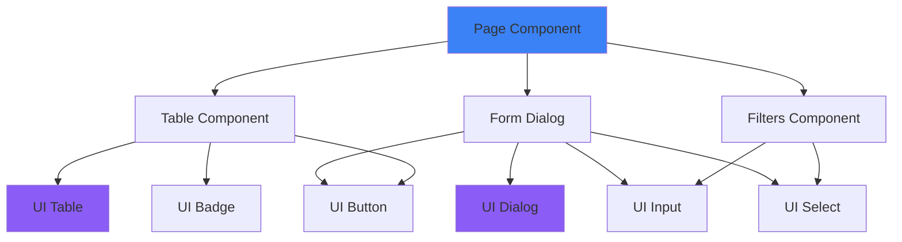

# Documentation des Composants - Dedalys

Cette documentation détaille les **27 composants React** de l'application Dedalys, organisés par catégorie.

## Table des Matières

- [Composants UI (shadcn/ui)](#composants-ui)
- [Composants Layout](#composants-layout)
- [Composants Clients](#composants-clients)
- [Composants Dossiers](#composants-dossiers)
- [Composants Audiences](#composants-audiences)
- [Composants Flash CR](#composants-flash-cr)
- [Composants Facturation](#composants-facturation)

---

## Composants UI

Composants réutilisables basés sur **Radix UI** et **shadcn/ui**.

### `button.tsx`
**Rôle** : Bouton personnalisable avec variants  
**Props** :
- `variant`: `"default" | "outline" | "ghost" | "error"`
- `size`: `"sm" | "default" | "lg"`

**Utilisation** :
```tsx
<Button variant="outline" size="sm">Cliquer</Button>
```

### `input.tsx`
**Rôle** : Champ de saisie texte  
**Props** : Étend `React.InputHTMLAttributes<HTMLInputElement>`

### `dialog.tsx`
**Rôle** : Modal/Dialog avec overlay  
**Composants** : `Dialog`, `DialogContent`, `DialogHeader`, `DialogTitle`, `DialogFooter`

### `table.tsx`
**Rôle** : Tableau avec en-têtes et lignes  
**Composants** : `Table`, `TableHeader`, `TableBody`, `TableRow`, `TableHead`, `TableCell`

### `card.tsx`
**Rôle** : Carte de contenu  
**Composants** : `Card`, `CardHeader`, `CardTitle`, `CardDescription`, `CardContent`

### `badge.tsx`
**Rôle** : Badge/Tag pour statuts  
**Props** :
- `variant`: `"default" | "secondary" | "outline" | "error"`

### `label.tsx`
**Rôle** : Label pour formulaires

### `select.tsx`
**Rôle** : Menu déroulant  
**Composants** : `Select`, `SelectTrigger`, `SelectContent`, `SelectItem`

### `tabs.tsx`
**Rôle** : Onglets de navigation  
**Composants** : `Tabs`, `TabsList`, `TabsTrigger`, `TabsContent`

### `breadcrumb.tsx`
**Rôle** : Fil d'Ariane de navigation

### `kpi-card.tsx`
**Rôle** : Carte KPI pour le dashboard  
**Props** :
- `title`: string
- `value`: string
- `subtitle`: string
- `icon`: LucideIcon
- `colorScheme`: `"blue" | "purple" | "orange" | "emerald"`
- `trend?`: `"up" | "down"`

### `empty-state.tsx`
**Rôle** : État vide avec icône et message

---

## Composants Layout

### `AppLayout.tsx`
**Rôle** : Layout principal de l'application avec sidebar  
**Structure** :
```tsx
<AppLayout>
  <Sidebar />
  <main>{children}</main>
</AppLayout>
```

### `Sidebar.tsx`
**Rôle** : Barre latérale de navigation  
**Fonctionnalités** :
- Navigation entre modules
- Indicateur de page active
- Logo et branding

**Navigation** :
- Dashboard (`/`)
- Clients (`/clients`)
- Dossiers (`/dossiers`)
- Audiences (`/audiences`)
- Flash CR (`/flash-cr`)
- Facturation (`/facturation`)

### `MobileNav.tsx`
**Rôle** : Navigation mobile responsive  
**Fonctionnalités** :
- Menu hamburger
- Navigation adaptée aux petits écrans

---

## Composants Clients

### `client-table.tsx`
**Rôle** : Tableau d'affichage des clients  
**Props** :
```typescript
interface ClientTableProps {
  clients: Client[]
  getDossiersCount: (clientId: string) => number
}
```

**Fonctionnalités** :
- Affichage personne physique vs morale
- Icônes différenciées (User vs Building2)
- Colonne sticky pour actions
- Badges de statut facturation
- Lien vers page détail

**Colonnes** :
- Type (icône)
- Nom / Raison Sociale
- Entreprise
- Email
- Téléphone
- Ville / Pays
- Dossiers (count)
- Facturation (statut)
- Action (bouton "Ouvrir")

### `client-form-dialog.tsx`
**Rôle** : Formulaire de création/édition de client  
**Props** :
```typescript
interface ClientFormDialogProps {
  open: boolean
  onOpenChange: (open: boolean) => void
  client?: Client
}
```

**Fonctionnalités** :
- Sélection type (Personne Physique / Morale)
- Champs conditionnels selon le type
- Validation Zod
- Gestion des contacts multiples
- Support RCCM et pièce d'identité

**Champs Personne Physique** :
- Nom, Prénom
- Profession
- Pièce d'identité
- Email, Téléphone
- Adresse, Ville

**Champs Personne Morale** :
- Raison Sociale
- Forme Juridique (SA, SARL, SAS, etc.)
- Numéro RCCM
- Siège Social
- Représentant Légal
- Email, Téléphone
- Adresse, Ville

### `client-filters.tsx`
**Rôle** : Filtres pour la liste des clients  
**Filtres** :
- Type de client
- Ville
- Statut facturation

### `contact-form-dialog.tsx`
**Rôle** : Formulaire d'ajout de contact pour un client  
**Props** :
```typescript
interface ContactFormDialogProps {
  open: boolean
  onOpenChange: (open: boolean) => void
  clientId: string
}
```

**Champs** :
- Nom, Prénom
- Fonction
- Email, Téléphone
- Contact principal (checkbox)

---

## Composants Dossiers

### `dossier-form-dialog.tsx`
**Rôle** : Formulaire de création/édition de dossier  
**Props** :
```typescript
interface DossierFormDialogProps {
  open: boolean
  onOpenChange: (open: boolean) => void
  dossier?: Dossier
}
```

**Champs** :
- Numéro de dossier (auto-généré)
- Client (sélection)
- Type de dossier (Contentieux, Pré-contentieux, Transactionnel, Conseil)
- Domaine du droit (Travail, Civil, Immobilier, Commercial, Autre)
- Juridiction
- Avocat assigné (sélection)
- Statut (En cours, Terminé, En attente, Clôturé)
- Description

### `file-explorer.tsx`
**Rôle** : Explorateur de fichiers type Google Drive  
**Props** :
```typescript
interface FileExplorerProps {
  dossierId: string
}
```

**Fonctionnalités** :
- Création de dossiers
- Upload de fichiers
- Navigation hiérarchique
- Suppression d'éléments
- Affichage taille fichiers

**Actions** :
- `fetchFiles()` : Récupère les fichiers du dossier
- `createItem()` : Crée un dossier ou fichier
- `deleteItem(id)` : Supprime un élément

---

## Composants Audiences

### `audience-calendar.tsx`
**Rôle** : Calendrier visuel des audiences  
**Fonctionnalités** :
- Vue mensuelle
- Indicateurs d'audiences par jour
- Clic pour voir détails
- Badges d'urgence

### `audience-list.tsx`
**Rôle** : Liste des audiences avec filtres  
**Fonctionnalités** :
- Tri par date
- Filtrage par statut
- Affichage client et dossier liés

### `audience-form-dialog.tsx`
**Rôle** : Formulaire de création/édition d'audience  
**Props** :
```typescript
interface AudienceFormDialogProps {
  open: boolean
  onOpenChange: (open: boolean) => void
  audience?: Audience
}
```

**Champs** :
- Client (sélection)
- Dossier (sélection)
- Date et heure
- Durée estimée
- Juridiction
- Salle d'audience
- Titre
- Avocat
- Statut (À venir, Terminée, Reportée, Annulée)
- Notes

---

## Composants Flash CR

### `flash-cr-form-dialog.tsx`
**Rôle** : Formulaire de création de compte-rendu rapide  
**Props** :
```typescript
interface FlashCRFormDialogProps {
  open: boolean
  onOpenChange: (open: boolean) => void
  audienceId?: string
}
```

**Champs** :
- Audience (sélection ou pré-rempli)
- Contenu du CR (textarea)
- Destinataires (emails multiples)
- Statut (Brouillon, Envoyé, Archivé)

**Fonctionnalités** :
- Génération automatique depuis audience
- Envoi email aux destinataires
- Sauvegarde en brouillon

---

## Composants Facturation

### `invoice-form-dialog.tsx`
**Rôle** : Formulaire de création/édition de facture  
**Props** :
```typescript
interface InvoiceFormDialogProps {
  open: boolean
  onOpenChange: (open: boolean) => void
  invoice?: Invoice
}
```

**Champs** :
- Numéro de facture (auto-généré)
- Client (sélection)
- Dossier (optionnel)
- Audience (optionnel)
- Date
- Date d'échéance
- Montant HT
- TVA (%)
- Montant TTC (calculé)
- Statut (Payée, Impayée, Partielle)
- Méthode de paiement
- Notes

**Calculs automatiques** :
- Montant TVA = Montant HT × (TVA / 100)
- Montant TTC = Montant HT + Montant TVA

### `invoice-upload-dialog.tsx`
**Rôle** : Dialog pour uploader une facture PDF  
**Fonctionnalités** :
- Upload de fichier PDF
- Prévisualisation
- Association à un client/dossier

---

## Patterns Communs

### Pattern Form Dialog
Tous les formulaires suivent ce pattern :

```tsx
export function EntityFormDialog({ open, onOpenChange, entity }: Props) {
  const form = useForm({
    resolver: zodResolver(schema),
    defaultValues: entity || defaultValues,
  })

  const onSubmit = async (data) => {
    const method = entity ? 'PUT' : 'POST'
    const url = entity ? `/api/module/${entity.id}` : '/api/module'
    
    const response = await fetch(url, {
      method,
      body: JSON.stringify(data),
    })
    
    if (response.ok) {
      onOpenChange(false)
      // Refresh parent
    }
  }

  return (
    <Dialog open={open} onOpenChange={onOpenChange}>
      <DialogContent>
        <form onSubmit={form.handleSubmit(onSubmit)}>
          {/* Fields */}
        </form>
      </DialogContent>
    </Dialog>
  )
}
```

### Pattern Table
Tous les tableaux suivent ce pattern :

```tsx
export function EntityTable({ entities }: Props) {
  return (
    <Table>
      <TableHeader>
        <TableRow>
          <TableHead>Column 1</TableHead>
          {/* ... */}
        </TableRow>
      </TableHeader>
      <TableBody>
        {entities.map((entity) => (
          <TableRow key={entity.id}>
            <TableCell>{entity.field}</TableCell>
            {/* ... */}
          </TableRow>
        ))}
      </TableBody>
    </Table>
  )
}
```

---

## Dépendances entre Composants



---

Pour plus de détails sur l'architecture, consultez [ARCHITECTURE.md](ARCHITECTURE.md).
Pour la documentation des modules, consultez [MODULES.md](MODULES.md).
