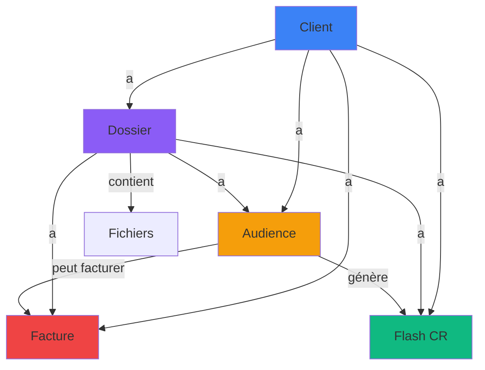

# Documentation des Modules - Dedalys

Cette documentation détaille les **5 modules principaux** de Dedalys et leurs interactions.

## Table des Matières

- [Module Clients](#module-clients)
- [Module Dossiers](#module-dossiers)
- [Module Audiences](#module-audiences)
- [Module Flash CR](#module-flash-cr)
- [Module Facturation](#module-facturation)
- [Relations Inter-Modules](#relations-inter-modules)

---

## Module Clients

**Route** : `/clients`  
**Objectif** : Gestion complète des clients (personnes physiques et morales)

### Structure

```
clients/
├── page.tsx                    # Liste des clients
├── [id]/
│   └── page.tsx                # Détail d'un client
components/clients/
├── client-table.tsx            # Tableau des clients
├── client-form-dialog.tsx      # Formulaire client
├── client-filters.tsx          # Filtres
└── contact-form-dialog.tsx     # Formulaire contact
```

### Fonctionnalités

#### Gestion des Clients
- **Création** : Personne physique ou morale
- **Édition** : Modification des informations
- **Suppression** : Suppression avec confirmation
- **Recherche** : Par nom, email, téléphone
- **Filtres** : Type, ville, statut facturation

#### Types de Clients

**Personne Physique** :
- Nom, Prénom
- Profession
- Pièce d'identité
- Coordonnées (email, téléphone, adresse)

**Personne Morale** :
- Raison Sociale
- Forme Juridique (SA, SARL, SAS, SASU, SNC, SCS, GIE, AUTRE)
- Numéro RCCM
- Siège Social
- Représentant Légal (nom, prénom, fonction)
- Coordonnées

#### Gestion des Contacts
- Ajout de contacts multiples par client
- Nom, Prénom, Fonction
- Email, Téléphone
- Marquage du contact principal

### Page Détail Client

Affiche :
- Informations complètes du client
- Liste des dossiers associés
- Historique des audiences
- Factures et paiements
- Contacts associés

### API Routes

- `GET /api/clients` - Liste tous les clients
- `POST /api/clients` - Crée un client
- `GET /api/clients/[id]` - Récupère un client
- `PUT /api/clients/[id]` - Met à jour un client
- `DELETE /api/clients/[id]` - Supprime un client

---

## Module Dossiers

**Route** : `/dossiers`  
**Objectif** : Gestion centralisée des dossiers juridiques avec explorateur de fichiers

### Structure

```
dossiers/
├── page.tsx                    # Liste des dossiers
├── [id]/
│   └── page.tsx                # Détail d'un dossier
components/dossiers/
├── dossier-form-dialog.tsx     # Formulaire dossier
└── file-explorer.tsx           # Explorateur de fichiers
```

### Fonctionnalités

#### Gestion des Dossiers
- **Numéro** : Auto-généré (format: DOS-YYYY-XXXX)
- **Client** : Lié à un client existant
- **Type** : Civil, Commercial, Pénal, Administratif
- **Type de dossier** : Contentieux, Pré-contentieux, Transactionnel, Conseil
- **Domaine du droit** : Travail, Civil, Immobilier, Commercial, Autre
- **Juridiction** : Tribunal compétent
- **Avocat assigné** : Avocat responsable
- **Statut** : En cours, Terminé, En attente, Clôturé
- **Dates** : Ouverture, Clôture
- **Description** : Notes et détails

#### Explorateur de Fichiers
Fonctionnalités type Google Drive :
- **Dossiers** : Création de dossiers hiérarchiques
- **Fichiers** : Upload de documents
- **Navigation** : Arborescence de fichiers
- **Actions** : Renommer, Supprimer, Télécharger
- **Métadonnées** : Taille, Date de modification

### Page Détail Dossier

Affiche :
- Informations du dossier
- Client associé
- Explorateur de fichiers
- Audiences liées
- Factures associées
- Timeline des événements

### API Routes

- `GET /api/dossiers` - Liste tous les dossiers
- `POST /api/dossiers` - Crée un dossier
- `GET /api/dossiers/[id]` - Récupère un dossier
- `PUT /api/dossiers/[id]` - Met à jour un dossier
- `DELETE /api/dossiers/[id]` - Supprime un dossier
- `GET /api/dossiers/[id]/files` - Liste les fichiers
- `POST /api/dossiers/[id]/files` - Upload un fichier

---

## Module Audiences

**Route** : `/audiences`  
**Objectif** : Calendrier des audiences avec rappels automatiques

### Structure

```
audiences/
└── page.tsx                    # Page audiences
components/audiences/
├── audience-calendar.tsx       # Calendrier visuel
├── audience-list.tsx           # Liste des audiences
└── audience-form-dialog.tsx    # Formulaire audience
```

### Fonctionnalités

#### Gestion des Audiences
- **Client** : Lié à un client
- **Dossier** : Lié à un dossier
- **Date et Heure** : Planification précise
- **Durée estimée** : Temps prévu (ex: "2h")
- **Juridiction** : Tribunal/Cour
- **Salle d'audience** : Localisation
- **Titre** : Description courte
- **Avocat** : Avocat en charge
- **Statut** : À venir, Terminée, Reportée, Annulée
- **Notes** : Informations complémentaires

#### Calendrier
- **Vue mensuelle** : Affichage calendrier
- **Indicateurs** : Nombre d'audiences par jour
- **Badges d'urgence** : Audiences urgentes en rouge
- **Navigation** : Mois précédent/suivant
- **Clic** : Ouvre le détail de l'audience

#### Liste des Audiences
- **Tri** : Par date (croissant/décroissant)
- **Filtres** : Par statut, par avocat, par juridiction
- **Recherche** : Par titre, client, dossier
- **Actions** : Modifier, Supprimer, Générer Flash CR

### Rappels Automatiques
- Email 24h avant l'audience
- Email 1h avant l'audience
- Notification in-app

### API Routes

- `GET /api/audiences` - Liste toutes les audiences
- `POST /api/audiences` - Crée une audience
- `GET /api/audiences/[id]` - Récupère une audience
- `PUT /api/audiences/[id]` - Met à jour une audience
- `DELETE /api/audiences/[id]` - Supprime une audience

---

## Module Flash CR

**Route** : `/flash-cr`  
**Objectif** : Génération rapide de comptes-rendus d'audiences

### Structure

```
flash-cr/
└── page.tsx                    # Liste des Flash CR
components/flash-cr/
└── flash-cr-form-dialog.tsx    # Formulaire Flash CR
```

### Fonctionnalités

#### Création de Flash CR
- **Audience** : Sélection de l'audience concernée
- **Contenu** : Éditeur de texte riche pour le CR
- **Destinataires** : Liste d'emails (séparés par virgules)
- **Statut** : Brouillon, Envoyé, Archivé

#### Workflow
1. **Sélection** : Choisir une audience terminée
2. **Rédaction** : Rédiger le compte-rendu
3. **Sauvegarde** : Enregistrer en brouillon
4. **Envoi** : Envoyer par email aux destinataires
5. **Archivage** : Archiver après envoi

#### Génération Automatique
- Pré-remplissage depuis l'audience :
  - Date et heure
  - Client et dossier
  - Juridiction
  - Avocat

#### Envoi Email
- Template HTML professionnel
- Pièces jointes (optionnel)
- Copie au cabinet
- Confirmation d'envoi

### API Routes

- `GET /api/flash-cr` - Liste tous les Flash CR
- `POST /api/flash-cr` - Crée un Flash CR
- `GET /api/flash-cr/[id]` - Récupère un Flash CR
- `PUT /api/flash-cr/[id]` - Met à jour un Flash CR
- `DELETE /api/flash-cr/[id]` - Supprime un Flash CR
- `POST /api/flash-cr/[id]/send` - Envoie le Flash CR

---

## Module Facturation

**Route** : `/facturation`  
**Objectif** : Suivi de la facturation et des paiements

### Structure

```
facturation/
└── page.tsx                    # Liste des factures
components/facturation/
├── invoice-form-dialog.tsx     # Formulaire facture
└── invoice-upload-dialog.tsx   # Upload facture PDF
```

### Fonctionnalités

#### Gestion des Factures
- **Numéro** : Auto-généré (format: FACT-YYYY-XXXX)
- **Date** : Date d'émission
- **Date d'échéance** : Date limite de paiement
- **Client** : Client facturé
- **Dossier** : Dossier associé (optionnel)
- **Audience** : Audience associée (optionnel)
- **Montant HT** : Montant hors taxes
- **TVA** : Pourcentage de TVA
- **Montant TTC** : Calculé automatiquement
- **Montant payé** : Montant déjà payé
- **Statut** : Payée, Impayée, Partielle
- **Méthode de paiement** : Espèces, Chèque, Virement, Mobile Money
- **Date de paiement** : Date du paiement
- **Pièce jointe** : PDF de la facture
- **Notes** : Informations complémentaires

#### Calculs Automatiques
```typescript
montantTVA = montantHT × (tva / 100)
montantTTC = montantHT + montantTVA
montantRestant = montantTTC - montantPaye
```

#### Statuts
- **Payée** : Montant payé = Montant TTC
- **Impayée** : Montant payé = 0
- **Partielle** : 0 < Montant payé < Montant TTC

#### Tableau de Bord Facturation
- Total facturé (HT, TTC)
- Total encaissé
- Total impayé
- Taux de recouvrement
- Factures en retard

#### Export et Impression
- Export PDF de la facture
- Impression directe
- Export Excel de la liste

### API Routes

- `GET /api/invoices` - Liste toutes les factures
- `POST /api/invoices` - Crée une facture
- `GET /api/invoices/[id]` - Récupère une facture
- `PUT /api/invoices/[id]` - Met à jour une facture
- `DELETE /api/invoices/[id]` - Supprime une facture
- `GET /api/invoices/stats` - Statistiques de facturation

---

## Relations Inter-Modules

### Diagramme de Relations



### Flux de Travail Typique

#### 1. Nouveau Client
```
Créer Client → Ajouter Contacts → Créer Dossier
```

#### 2. Gestion d'un Dossier
```
Créer Dossier → Upload Documents → Planifier Audience
```

#### 3. Audience et Suivi
```
Planifier Audience → Recevoir Rappel → Assister → Générer Flash CR → Envoyer CR
```

#### 4. Facturation
```
Créer Facture → Lier au Dossier/Audience → Envoyer au Client → Suivre Paiement
```

### Dépendances

| Module | Dépend de |
|--------|-----------|
| Clients | - (module racine) |
| Dossiers | Clients |
| Audiences | Clients, Dossiers |
| Flash CR | Audiences, Clients, Dossiers |
| Facturation | Clients, Dossiers (optionnel), Audiences (optionnel) |

### Cascade de Suppression

Lors de la suppression d'une entité :

- **Client supprimé** → Supprime tous ses dossiers, audiences, factures, Flash CR
- **Dossier supprimé** → Supprime ses fichiers, mais garde audiences et factures (set NULL)
- **Audience supprimée** → Supprime son Flash CR associé

---

Pour plus de détails sur les composants, consultez [COMPONENTS.md](COMPONENTS.md).
Pour l'architecture technique, consultez [ARCHITECTURE.md](ARCHITECTURE.md).
